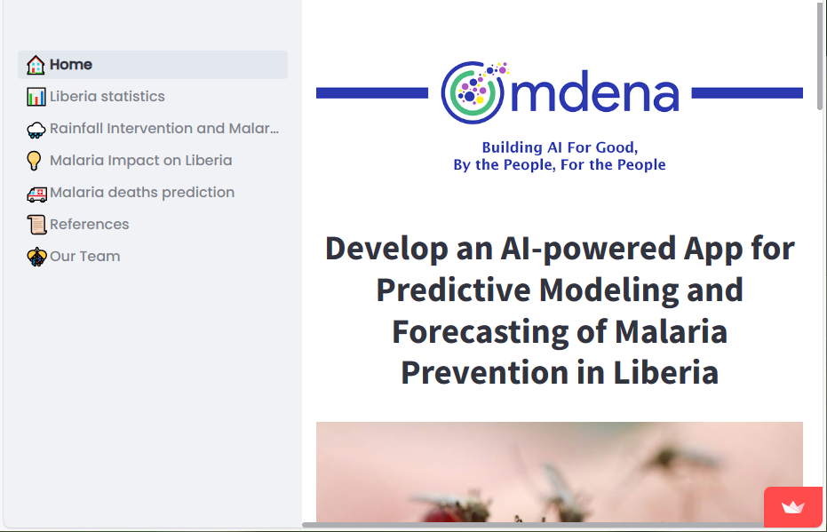

# Malaria Prevention Modeling App

## Docker

**Create the Image**
```
docker build -t omdena_app .
```

**Create the Container**
```
docker run -p 8501:8501 omdena_app
```

Go to ```http://localhost:8501/``` and visualize the app:



Link to the streamlit application on streamlit cloud--> https://malaria-prediction.streamlit.app/
